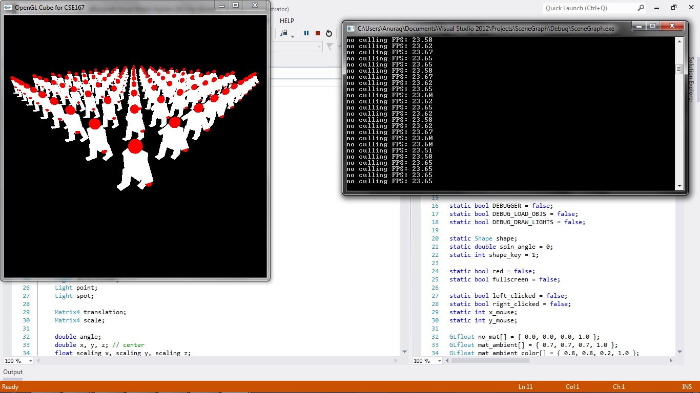

CSE 167 - Introduction to Computer Graphics
Project 5: Scene Graph
==========

(See full project specifications here: http://ivl.calit2.net/wiki/index.php/Project5Fall13)

Renders an army of ```army_size x army_size``` robots with default walking animation and prints out FPS. ```army_size``` is found at the top of ```Shape.cpp```. Upon pressing 'c', toggle object-level culling with bounding spheres. Objects can be rotated with mouse left-click and scaled with mouse right-click. Objects can be moved using keyboard commands as in cube but not advisable.

Mouse:
* left-click: Rotate army of robots via ```trackballRotation``` in ```Shape.cpp```
* right-click: Scale army of robots

Culling:
* c: Toggle culling

Note: This is a bit buggy because the Camera matrix is not being properly updated when trackballRotation updates ModelView matrix.



